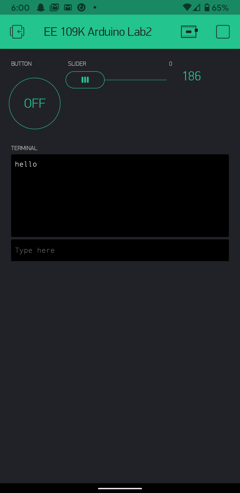

Name: Tuan Pham

EID: tp23843

Team Number: 11

## Questions

1. What is the purpose of an IP address?

    Machines in LANs use IP addresses as unique "identifiers" when communicating between different LANs.

2. What is a DNS? What are the benefits of using domain names instead of IP addresses?

    DNS, or Domain Name Service, is a lookup service that maps a symbolic name to an IP address making them easier to remember and refer to.

3. What is the difference between a static IP and a dynamic IP?

    A static IP is given to a device and does not change, while a dynamic IP is assigned by the network when the device connects and is able to change over time.

4. What is the tradeoff between UDP and TCP protocols?

    TCP is connection-based and reliable. UDP is connection-less and unreliable, but fast.

5. Why can't we use the delay function with Blynk?

    Since Blynk is an event-based interface, a delay function would mess up the timing of it. It will also block other functions.

6. What does it mean for a function to be "Blocking"?

    It prevents other functions from running asynchronously.

7. Why are interrupts useful for writing Non-Blocking code?

    It allows functions to interrupt each other when they are running, in order to handle sudden changes in conditions or unexpected inputs.

8. What is the difference between interface and implementation? Why is it important?

   Interface defines how a function called, while implementation define what the function does. This distinction is important because it is useful to know
	what Blynk takes care of for you and what you need to write.

9. Screenshot of your Blynk App:

    
